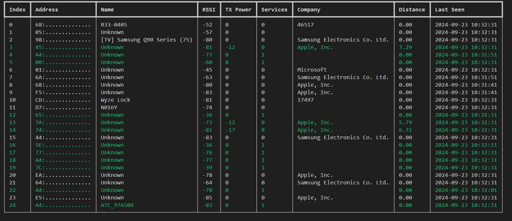

<h1 align="center">Bluetooth "Wall of Sheep"</h1>


> Bluetooth "Wall of Sheep" is a lightweight Python app that scans for nearby Bluetooth devices and displays them in a live, auto-refreshing terminal table. It's ideal for demonstrating Bluetooth visibility and presence tracking in real time.

## 🚀 Quick Start

Clone, install, and run in well under a minute. The Bluetooth SIG lookup files
(`service_uuids.yaml`, `company_identifiers.yaml`) are committed to the repo, so
**the first scan works fully offline** — no download step on first run.

### Option A — `uv` (recommended)

```bash
git clone https://github.com/skittleson/bluetooth-wos.git
cd bluetooth-wos
uv tool install .
bluetooth-wos
```

Or run from source without a global install:

```bash
git clone https://github.com/skittleson/bluetooth-wos.git
cd bluetooth-wos
uv venv
uv pip install -r requirements.txt
uv run bluetooth_wos.py
```

### Option B — plain `pip`

```bash
git clone https://github.com/skittleson/bluetooth-wos.git
cd bluetooth-wos
python -m venv .venv
source .venv/bin/activate          # Windows: .venv\Scripts\activate
pip install .
bluetooth-wos
```

`pip install .` builds the package and creates the `bluetooth-wos` console
command (defined in `pyproject.toml` as `bluetooth-wos = "bluetooth_wos:main"`).
If you'd rather not install, you can run the script directly after installing
the requirements:

```bash
pip install -r requirements.txt
python bluetooth_wos.py
```

## 👀 Expected output

On launch you'll see a **`Scanning...`** progress bar while the first 10-second
discovery pass runs. After that, a live [`rich`](https://github.com/Textualize/rich)
table refreshes roughly twice a second with the devices found nearby:

| Index | Address       | Name    | RSSI | TX Power | Services | Company | Distance | Last Seen           | First Seen          |
|-------|---------------|---------|------|----------|----------|---------|----------|---------------------|---------------------|
| 0     | 4A2...        | Unknown | -63  | 0        | 1        | Apple   | 2.14 *   | 2026-06-30 17:10:02 | 2026-06-30 17:09:41 |
| 1     | C81...        | My Watch| -48  | -59      | 0        | Garmin  | 0.87     | 2026-06-30 17:10:02 | 2026-06-30 17:09:52 |

*(Illustrative — not a real capture.)*

Notes on the display:

- Device **addresses are redacted by default** (only the first 3 characters show,
  the rest are masked) for privacy.
- A `*` next to **Distance** means the distance was *estimated* by regression
  from other devices rather than computed directly from a device's own TX Power.
- Rows with a TX Power or advertised services are highlighted green.
- Devices decode common advertisement service data passively (no GATT
  connection) — Temperature, Humidity, Battery Level, TX Power, Heart Rate, and
  Eddystone (TLM/UID/URL). Decoded values are printed above the table as they
  arrive.
- The current device list is written to **`devices.csv`** in the working
  directory on every refresh.
- A debug log is written to `bluetooth-discovery.log`.
- Press **Ctrl-C** to quit (it prints `Bye bye` and exits).

## 💻 Requirements & platform notes

- **Python 3.10+** (see `pyproject.toml` / `requires-python`).
- **Bluetooth adapter** with permission for the terminal/process to use it.

Bluetooth access on the host OS is the most common reason a scan silently
returns nothing:

- **Linux** — Fully supported. Uses [BlueZ](http://www.bluez.org/) via
  `dbus-fast`. You may need elevated privileges to scan. Either run with `sudo`,
  or grant the Python binary the required capabilities once:

  ```bash
  sudo setcap 'cap_net_raw,cap_net_admin+eip' "$(readlink -f "$(which python3)")"
  ```

- **macOS 12+** — bleak supports macOS via CoreBluetooth, but macOS will prompt
  for **Bluetooth permission**. Your terminal app (Terminal, iTerm, etc.) must be
  granted Bluetooth access under *System Settings → Privacy & Security →
  Bluetooth*, or the scan **silently returns no devices**. Note: this repo pins
  `dbus-fast` unconditionally in `requirements.txt`/`pyproject.toml`, which is a
  Linux-only package — on macOS you'll need to install without that pin (bleak's
  own dependency resolver already excludes it off Linux).

- **Windows** — Not supported as-shipped. Although `bleak` itself has a Windows
  (WinRT) backend, this project hard-pins `dbus-fast` (a **Linux-only**
  dependency) in `pyproject.toml`/`requirements.txt`, so `pip install .` will
  fail to install cleanly on Windows. Windows is currently untested/unsupported.

## ✅ Features

### 🔍 Core Features
- Live discovery of nearby Bluetooth devices
- Interactive "Wall of Sheep" display with metadata
- Company identification via public device listing
- Real-time CSV export of scanned device data (`devices.csv`)

### 📏 Device Intelligence
- Estimates distance using RSSI and TX Power
- Fills in missing distances by regression across observed devices
- Removes transient devices to handle address randomization
- Redacts device MAC addresses by default for privacy
- Decodes common service data passively (no GATT connection): Temperature,
  Humidity, Battery Level, TX Power, Heart Rate, and Eddystone (TLM/UID/URL)

### 🔧 Configurable Behavior
- Adjustable timeout for inactive devices
- Toggle address visibility

## ✨ Demo



## Development

`python -m pylint $(git ls-files '*.py')`

## 🛣️ Roadmap

 - [ ] Resolve services by name
 - [x] Estimates distance from transmitter and receiver of a device given ONLY RSSI if know distance values are present.
 - [ ] Configurable columns
 - [ ] Fingerprint devices that keep changing MAC addresses
 - [ ] Show adv data
 - [ ] Interactive way to go into service data
 - [x] Resolve common service->characteristics such as temp/humidity
 - [ ] attempt to keep same indexes of current devices
 - [x] Load spinner on first load. It's boring to see nothing in a table
 - [ ] no coloring option

## 🤝 Contributing

Contributions, issues and feature requests are welcome.<br />
Feel free to check [issues page](https://github.com/skittleson/bluetooth-wos/issues) if you want to contribute.<br />

## Author

👤 **Spencer Kittleson**

- Github: [@skittleson](https://github.com/skittleson)
- LinkedIn: [@skittleson](https://www.linkedin.com/in/skittleson)
- Blog: [DoCodeThatMatters](https://docodethatmatters.com)
- X: [@skittleson](https://twitter.com/skittleson)
- StackOverflow: [spencer](https://stackoverflow.com/users/2414540/spencer)

## Show your support

⭐️ this repository if this project helped you! It motivates me a lot! 👋

Buy me a coffee ☕: <a href="https://www.buymeacoffee.com/skittles">skittles</a><br />

## Built with ♥

- python
- rich
- bleak
- ruamel.yaml

## 📄 License

MIT — see [LICENSE](LICENSE).

## 📑 References

 - https://bitbucket.org/bluetooth-SIG/public/src/main/assigned_numbers/uuids/service_uuids.yaml
