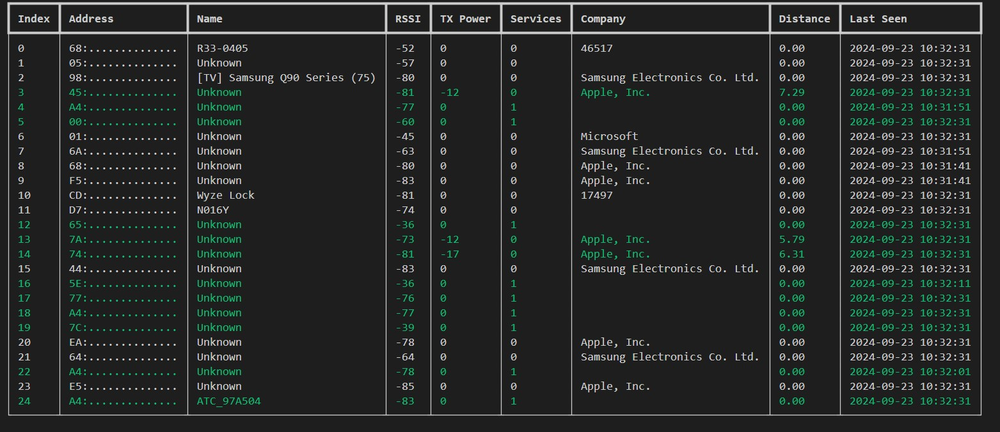

<h1 align="center">Bluetooth "Wall of Sheep"</h1>

> A little app that discovers bluetooth devices near by and displays them on a board.

## ✨ Demo

## ✅ Features

 - The "Wall of Sheep".  A list of all bluetooth devices and useful information.
 - Writes a current device list to a csv file.
 - Identifies the company of a device using a public listing.
 - Calculates distance from transmitter and receiver of a device with TX Power and RSSI.
 - Removes devices that have not been present for certain amount of time. This combats the "private resolvable random addresses" feature that prevents tracking of devices.
 - Highlights devices that tend to "stick around"
 - Hide device addresses from screen

## 🚀 Quick Start

`pip install -r requirements.txt`

`python index.py`

## Development

`python -m  pylint $(git ls-files '*.py')`

### 🛠️ Build Portable 

`pyinstaller index.py -F -n bluetooth-wos`

## 🛣️ Roadmap
 
 - Resolve services by name
 - Estimates distance from transmitter and receiver of a device given ONLY RSSI if know distance values are present.
 - Configurable columns
 - Load spinner on first load. It's boring to see nothing in a table
 - Fingerprint devices that keep changing MAC addresses
 - Show adv data
 - Go into service data
 - Resolve common service->characteristics such as temp/humidity
 - attempt to keep same indexes of current devices

## 🤝 Contributing

Contributions, issues and feature requests are welcome. 
Feel free to check [issues page](https://github.com/skittleson/bluetooth-wos/issues) if you want to contribute. 

## Author

👤 **Spencer Kittleson**

- Github: [@skittleson](https://github.com/skittleson)
- LinkedIn: [@skittleson](https://www.linkedin.com/in/skittleson)
- Blog: [DoCodeThatMatters](https://docodethatmatters.com)
- X: [@skittleson](https://twitter.com/skittleson)
- StackOverflow: [spencer](https://stackoverflow.com/users/2414540/spencer)

## Show your support

⭐️ this repository if this project helped you! It motivates me a lot! 👋

Buy me a coffee ☕: <a href="https://www.buymeacoffee.com/skittles">skittles</a> 

## Built with ♥

- python
- rich
- bleak
- ruamel.yaml

## 📑 References

 - https://bitbucket.org/bluetooth-SIG/public/src/main/assigned_numbers/uuids/service_uuids.yaml
